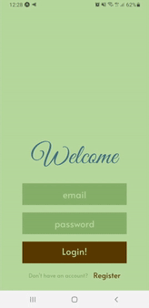
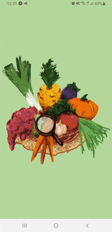

# Niles "The Digital Manservant"

## Overview

**Niles - the Digital Manservant** is an app build with the intention to make life a little bit easier. As a person who loves to cook, but who is getting tired of having to make shopping lists and finding recipes with what I have in store. I wanted to create an app that helps me with this process, so I have more time to spend on actual cooking. (or other things)

## MVP

Right now I have a M(inimal) V(iable) P(roduct) ready, in which you can register/login and then either take a picture of a product for scanning with Google Cloud Vision API or scan the barcode of a product with the expo's barcodeScanner connected to the Open Food Facts API.   
Since they both work with labels, the user is then able to select the label that fits their product best with which the app will then search for and display recipes, thanks to Edamam Recipe API. Clicking on a recipe will land you on the recipe's details page where you can read and cross off the ingredients. 

**Login & Register**                                           
 **=>**  

  

## Upcoming features

First off, I want to add on what I already have. Creating select options to filter the recipes for example, or perhaps give the user the option to also search for recipes by just plain typing of the words.

I also really want to add a kind of digital storage space, where as a user you can scan the product that you buy, and then select from your storage the items that you want to use for cooking and then find recipes including those items.

Next I also want to create a more ellaborate shopping list (instead of just crossing of the ingredients)

And then it would really start to feel like a great app. But to make it even better I would like to add a kind of food diary where you can keep track of what you eat. And where Niles could give you tips on what to eat, since he will know what might be missing from your diet.

## Tech used

- React-Native
- Redux
- Axios
- Expo
- Firebase
- Express
- REST API
- Sequelize
- PostgreSQL
- Node js
- Google Cloud Vision
- Edamam Recipe API
- Open Food Facts API

## Git
During this project I also learned how to use git properly:
- creating new branches when implementing new features
- regular and clear commit message
- pull requests with summary

## History of pull requests

## Project Board

Go to [project board](<https://github.com/users/DiegoOTdC/projects/1>)

## Wireframe

Go to [wireframe](<https://wireframepro.mockflow.com/view/M66f4c119388556d53ef8602ab0b386281597043905404#/page/De36801225c9e96e06665bd016a7d83b0>)

## Datamodel

Go to [datamodel](<https://dbdiagram.io/d/5f3152ef08c7880b65c5baf2>)

## Backend

Go to the [backend](<https://github.com/DiegoOTdC/Niles-backend>)
